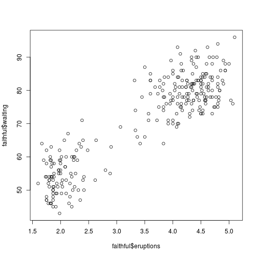

Shiny Application with Reproducible Pitch
========================================================
author: ??
date: 15 Sep 2020
autosize: true

First Slide
========================================================


OVERVIEW 

Old Faithful Geyser Data

Description
Waiting time between eruptions and the duration of the eruption for the Old Faithful geyser in Yellowstone National Park, Wyoming, USA.

We show how the number of histogram bins influence the graph visability.

Access to my ShinyApp page via - 

Source code is available on the GitHub 
https://github.com/TheNoMadCanary/ShinyApplicationReproduciblePitch

Slide With Code
========================================================


```r
summary(faithful)
```

```
   eruptions        waiting    
 Min.   :1.600   Min.   :43.0  
 1st Qu.:2.163   1st Qu.:58.0  
 Median :4.000   Median :76.0  
 Mean   :3.488   Mean   :70.9  
 3rd Qu.:4.454   3rd Qu.:82.0  
 Max.   :5.100   Max.   :96.0  
```

Slide With Plot
========================================================




THANK YOU
========================================================

